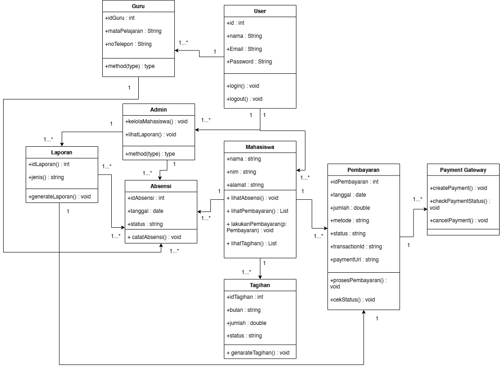
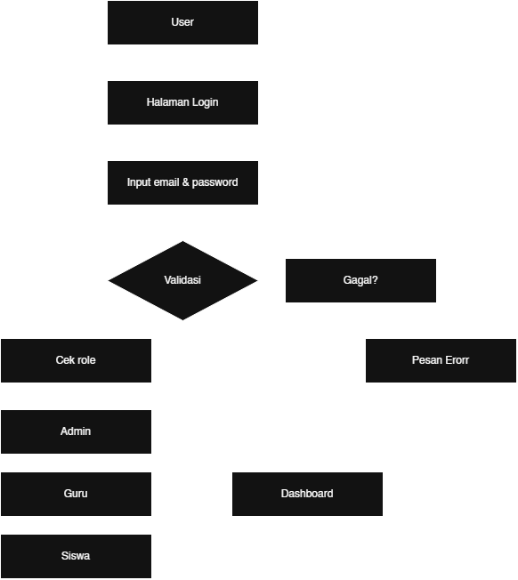

# SPESIFIKASI KEBUTUHAN PERANGKAT LUNAK (SKPL)
## Sistem Informasi Griya Bintang Quran

---

## 1. Pendahuluan

### 1.1 Tujuan
Dokumen Spesifikasi Kebutuhan Perangkat Lunak (SKPL) ini dibuat untuk mendokumentasikan kebutuhan perangkat lunak pada **Sistem Informasi Griya Bintang Quran**.

Sistem ini dikembangkan untuk membantu proses pengelolaan data mahasiswa/siswa, guru, absensi, tagihan, pembayaran, dan laporan secara terintegrasi.

Dokumen ini menjadi acuan dalam proses perancangan, pengembangan, pengujian, dan evaluasi sistem.

### 1.2 Ruang Lingkup
Sistem Informasi Griya Bintang Quran merupakan aplikasi berbasis web yang digunakan oleh tiga jenis pengguna, yaitu:
* **Admin**
* **Guru**
* **Siswa/Mahasiswa**

Sistem menyediakan fitur yang disesuaikan dengan hak akses masing-masing pengguna.

Ruang lingkup sistem meliputi:
1. Autentikasi pengguna.
2. Registrasi pengguna.
3. Pengelolaan data mahasiswa/siswa.
4. Pengelolaan data guru.
5. Pengelolaan absensi.
6. Pengelolaan tagihan.
7. Pengelolaan pembayaran.
8. Pengelolaan laporan.
9. Pengelolaan profil pengguna.

### 1.3 Definisi dan Singkatan

| Istilah | Definisi |
| :--- | :--- |
| **SKPL** | Spesifikasi Kebutuhan Perangkat Lunak |
| **Admin** | Pengguna yang memiliki hak akses untuk mengelola data sistem |
| **Guru** | Pengguna yang memiliki akses terhadap data pembelajaran dan absensi |
| **Siswa** | Pengguna yang dapat melihat informasi akademik dan tagihan |
| **CRUD** | *Create, Read, Update, Delete* |
| **NIM** | Nomor Induk Mahasiswa/Siswa |
| **Role** | Hak akses pengguna dalam sistem |

---

## 2. Deskripsi Umum Sistem

### 2.1 Perspektif Produk
Sistem Informasi Griya Bintang Quran merupakan aplikasi web yang dibangun menggunakan *framework* Laravel dan *database* MySQL.

Sistem menggunakan konsep *role-based access* sehingga setiap pengguna memperoleh akses sesuai dengan *role* yang dimilikinya.

**Arsitektur Sederhana Sistem:**


### 2.2 Karakteristik Pengguna

#### Admin
Admin bertanggung jawab terhadap pengelolaan data utama sistem. Admin dapat:
* Mengelola data mahasiswa/siswa.
* Mengelola data guru.
* Mengelola data absensi.
* Mengelola data tagihan.
* Mengelola data pembayaran.
* Melihat dan mengelola laporan.

#### Guru
Guru menggunakan sistem untuk mendukung kegiatan pembelajaran dan pengelolaan absensi. Guru dapat:
* Melihat *dashboard*.
* Melihat data mahasiswa/siswa.
* Mengelola absensi.
* Melihat informasi yang berkaitan dengan kegiatan pembelajaran.

#### Siswa/Mahasiswa
Siswa/Mahasiswa menggunakan sistem untuk memperoleh informasi mengenai data akademik dan administrasi. Siswa/Mahasiswa dapat:
* Melihat *dashboard*.
* Melihat data absensi.
* Melihat tagihan.
* Melihat status pembayaran.
* Melihat dan mengelola profil.

---

## 3. Kebutuhan Fungsional

### 3.1 Autentikasi

#### KF-01 Login
Sistem harus menyediakan fitur login bagi pengguna.
* **Input:**
  * Email
  * Password
  * Role
* **Proses:**
  1. Pengguna memasukkan email dan password.
  2. Sistem melakukan validasi data.
  3. Sistem memeriksa role pengguna.
  4. Sistem mengarahkan pengguna ke dashboard sesuai role.
* **Output:**
  * Pengguna berhasil masuk ke sistem.
  * Pengguna diarahkan ke dashboard sesuai role.

#### KF-02 Registrasi
Sistem harus menyediakan fitur registrasi pengguna. Data yang dapat dimasukkan meliputi:
* Nama
* Email
* Password
* Role
* NIM untuk siswa
* Mata pelajaran untuk guru
* Nomor telepon
* Alamat

#### KF-03 Logout
Sistem harus menyediakan fitur logout untuk mengakhiri sesi pengguna.

#### KF-04 Reset Password
Sistem menyediakan fitur untuk melakukan reset password apabila pengguna lupa password.

---

## 4. Kebutuhan Fungsional Admin

* **KF-05 Dashboard Admin:** Sistem menyediakan dashboard khusus Admin yang menampilkan informasi utama sistem.
* **KF-06 Pengelolaan Data Mahasiswa:** Admin dapat melihat, menambahkan, mengubah, menghapus, serta mencari data mahasiswa. Data mahasiswa meliputi: Nama, NIM, Nomor HP, dan Alamat.
* **KF-07 Pengelolaan Data Guru:** Admin dapat melihat, menambahkan, mengubah, dan menghapus data guru. Data guru meliputi: Nama, Mata pelajaran, dan Nomor telepon.
* **KF-08 Pengelolaan Absensi:** Admin dapat melihat dan mengelola data absensi mahasiswa. Status absensi terdiri dari: **Hadir**, **Izin**, **Sakit**, dan **Alpha**.
* **KF-09 Pengelolaan Tagihan:** Admin dapat melihat, menambahkan, mengubah, menghapus, serta melihat status tagihan mahasiswa. Status tagihan meliputi: **Belum Lunas**, **Menunggu Pembayaran**, dan **Lunas**.
* **KF-10 Pengelolaan Pembayaran:** Admin dapat melihat data pembayaran yang dilakukan oleh mahasiswa. Status pembayaran terdiri dari: **Pending**, **Success**, **Failed**, dan **Cancelled**.
* **KF-11 Laporan:** Sistem menyediakan fitur laporan yang dapat digunakan Admin untuk melihat informasi yang berkaitan dengan aktivitas sistem.

---

## 5. Kebutuhan Fungsional Guru

* **KF-12 Dashboard Guru:** Sistem menyediakan dashboard khusus Guru.
* **KF-13 Data Mahasiswa:** Guru dapat melihat data mahasiswa yang berkaitan dengan kegiatan pembelajaran.
* **KF-14 Pengelolaan Absensi:** Guru dapat mencatat dan mengelola kehadiran mahasiswa. Data absensi meliputi: Mahasiswa, Guru, Tanggal, dan Status kehadiran.

---

## 6. Kebutuhan Fungsional Siswa/Mahasiswa

* **KF-15 Dashboard Siswa:** Sistem menyediakan dashboard khusus Siswa/Mahasiswa.
* **KF-16 Melihat Absensi:** Siswa/Mahasiswa dapat melihat riwayat absensinya.
* **KF-17 Melihat Tagihan:** Siswa/Mahasiswa dapat melihat tagihan yang dimiliki. Informasi tagihan meliputi: Bulan, Jumlah, dan Status.
* **KF-18 Melihat Pembayaran:** Siswa/Mahasiswa dapat melihat status pembayaran terhadap tagihan.
* **KF-19 Mengelola Profil:** Siswa/Mahasiswa dapat melihat dan mengubah informasi profil yang tersedia.

---

## 7. Kebutuhan Non-Fungsional

* **KNF-01 Usability:** Sistem harus memiliki antarmuka yang mudah dipahami dan digunakan oleh pengguna.
* **KNF-02 Performance:** Sistem harus mampu menampilkan halaman dan memproses permintaan pengguna dalam waktu yang wajar.
* **KNF-03 Security:** Sistem harus:
  * Melindungi password pengguna.
  * Menggunakan autentikasi.
  * Membatasi akses berdasarkan role.
  * Melindungi form dari request yang tidak sah menggunakan CSRF protection.
* **KNF-04 Availability:** Sistem dapat digunakan selama server aplikasi dan database tersedia.
* **KNF-05 Maintainability:** Sistem dikembangkan menggunakan struktur Laravel sehingga kode dapat dipelihara dan dikembangkan lebih lanjut.

---

## 8. Data yang Dikelola

Sistem menggunakan beberapa entitas utama:
* User
* Admin
* Guru
* Mahasiswa
* Absensi
* Tagihan
* Pembayaran
* Laporan

**Hubungan antar entitas secara umum:**

```text
User
 ├── Admin
 ├── Guru
 └── Mahasiswa
       ├── Absensi
       └── Tagihan
             └── Pembayaran

Admin
 └── Laporan
```

---

## 9. Class Diagram

Class Diagram menggambarkan struktur kelas dan hubungan antar kelas yang terdapat pada Sistem Informasi Griya Bintang Quran.


*Gambar 1. Class Diagram Sistem Informasi Griya Bintang Quran*

> Letakkan file gambar Class Diagram pada folder `images` dengan nama `class-diagram.png`.

**Struktur folder:**
```text
project/
│
├── images/
│   └── class-diagram.png
│
├── README.md
└── SKPL.md
```

---

## 10. Alur Umum Sistem

### 10.1 Alur Login



## 11. Batasan Sistem

Sistem memiliki beberapa batasan:
1. Sistem berbasis web.
2. Sistem membutuhkan koneksi ke database MySQL.
3. Hak akses pengguna dibatasi berdasarkan role.
4. Sistem hanya dapat digunakan oleh pengguna yang telah terdaftar.
5. Pengelolaan data mengikuti struktur database yang telah ditentukan.

---

## 12. Teknologi

Teknologi yang digunakan dalam pengembangan sistem:

| Teknologi | Penggunaan |
| :--- | :--- |
| **Laravel 13** | Backend Framework |
| **PHP 8.4** | Bahasa Pemrograman |
| **MySQL** | Database |
| **Blade** | Template Engine |
| **Tailwind CSS** | User Interface |
| **Bootstrap** | Komponen Interface |
| **JavaScript** | Interaksi halaman |
| **Git** | Version Control |
| **GitHub** | Repository |

---

## 13. Kesimpulan

Sistem Informasi Griya Bintang Quran dirancang sebagai aplikasi berbasis web untuk membantu pengelolaan data akademik dan administrasi.

Sistem menyediakan tiga role utama yaitu **Admin**, **Guru**, dan **Siswa/Mahasiswa** dengan hak akses yang berbeda.

Fitur utama sistem mencakup autentikasi, pengelolaan mahasiswa, guru, absensi, tagihan, pembayaran, dan laporan.